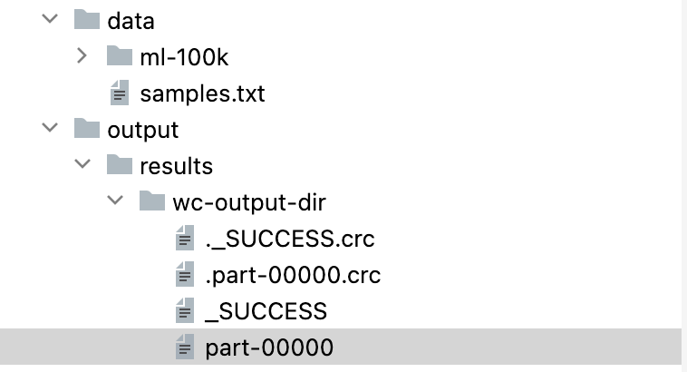

# Scala-Saprk-Applications

## Spark 
is a fast and general cluster computing system for Big Data. It provides high-level APIs in Scala, Java, Python, and R, and an optimized engine that supports general computation graphs for data analysis. It also supports a rich set of higher-level tools including Spark SQL for SQL and structured data processing, MLlib for machine learning, GraphX for graph processing, and Spark Streaming for stream processing.

## RDD 

RDDs are the building blocks of Spark. They are immutable distributed collections of objects. Each dataset in RDD is divided into logical partitions, which may be computed on different nodes of the cluster. RDDs can contain any type of Python, Java, or Scala objects, including user-defined classes.

### Word Count
#### 1.1 Word Count with RDDs

Input:

data/samples.txt

hello scala
how are you
great news !

hello scala

Output:

scala  2
are  1
news  1
you  1
how  1
!  1
hello  2
great  1

#### 1.2 Word Count with dataframes

#### 1.3 Word Count with Datasets